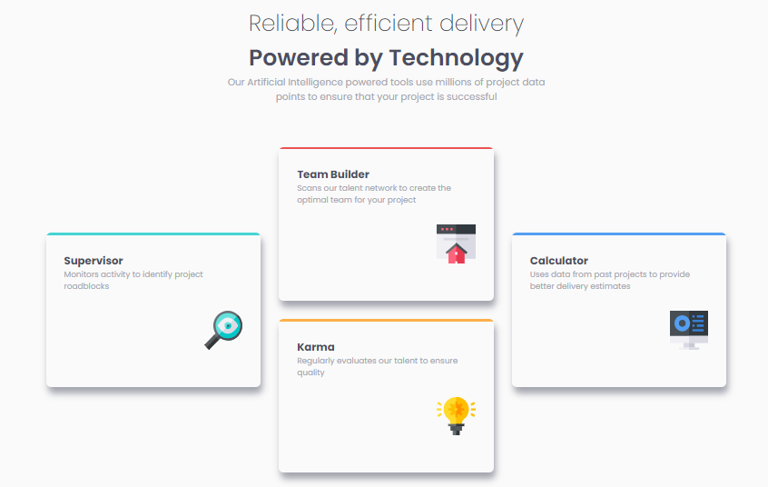

# Frontend Mentor - Four card feature section solution

This is a solution to the [Four card feature section challenge on Frontend Mentor](https://www.frontendmentor.io/challenges/four-card-feature-section-weK1eFYK). Frontend Mentor challenges help you improve your coding skills by building realistic projects. 

## Table of contents

- [Overview](#overview)
  - [The challenge](#the-challenge)
  - [Screenshot](#screenshot)
  - [Links](#links)
- [My process](#my-process)
  - [Built with](#built-with)
  - [What I learned](#what-i-learned)
  - [Continued development](#continued-development)
  - [Useful resources](#useful-resources)
- [Author](#author)
- [Acknowledgments](#acknowledgments)

## Overview

### The challenge

Users should be able to:

- View the optimal layout for the site depending on their device's screen size.

### Screenshot

### Links

- Solution URL: [Add solution URL here](https://github.com/misaeljoelp/four-cards-colors)
- Live Site URL: [Github pages](https://misaeljoelp.github.io/four-cards-colors/)

## My process

### Built with

- Semantic HTML5 markup
- CSS custom properties
- Flexbox
- CSS Grid
- Mobile-first workflow
- Simple animations

### What I learned

I learned that I can use diferents displays to an element HTML using media queries.

### Continued development

Practice and more practice, flexbox, grid.

## Author

- Frontend Mentor - [@misaeljoelp](https://www.frontendmentor.io/profile/misaeljoelp)

